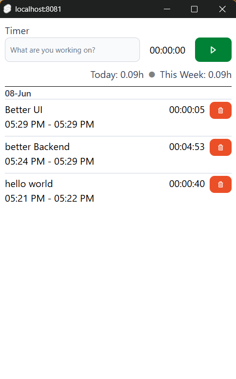

# Tak

`tak` is a desktop app timer. It allows to record the time of tasks your are
working on.



To develop:

```
npm install --prefix client
npm run build --prefix client
deno task dev
```

To build an executable: `deno task dist`

Architecture

- UI uses svelteKit with flowbite-svelte and tailwindcss.
- backend uses deno and [deno-webui](https://github.com/webui-dev/deno-webui)
- database is deno kv
